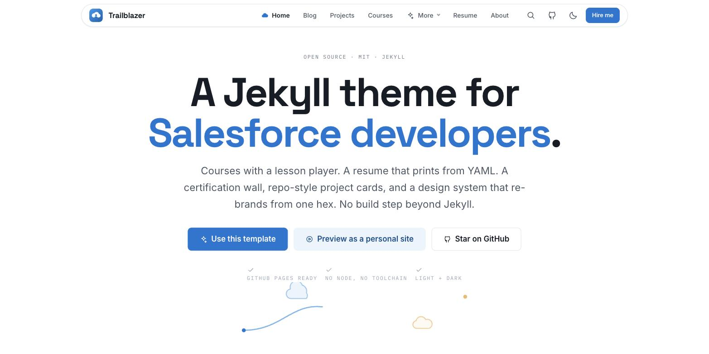
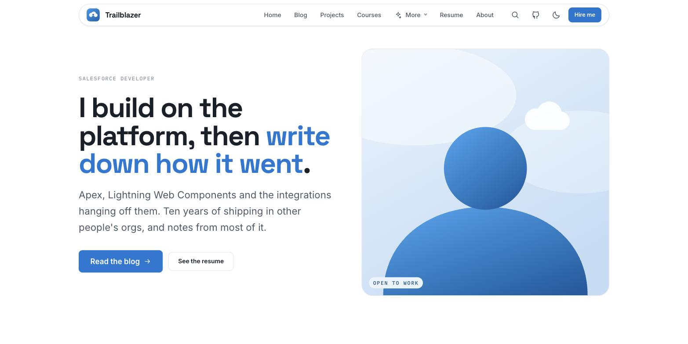
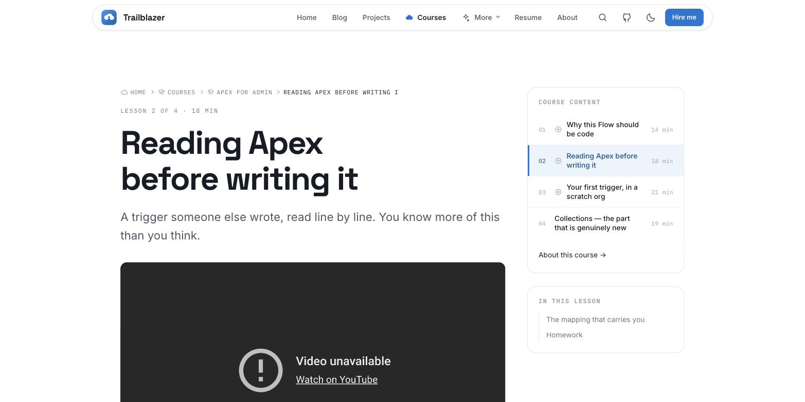
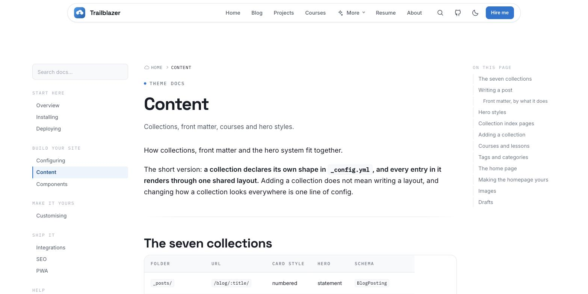
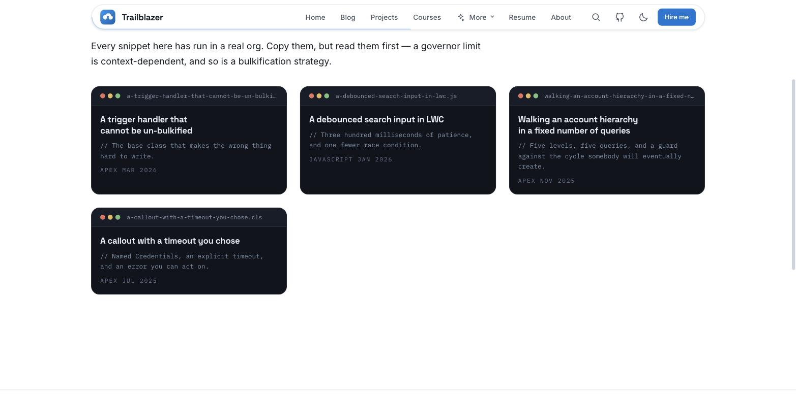

<div align="center">


# Trailblazer

**A Jekyll theme for Salesforce developers.**

A printable resume driven from YAML · a certification wall · typed collections for
posts, projects, snippets, talks, videos, courses and books · per-collection structured data ·
command-palette search · dark mode · no JavaScript build step.

[**Use this template**](https://github.com/imswarnil/trailblazer-jekyll-theme/generate) ·
[Live demo](https://trailblazer.imswarnil.com) ·
[Documentation](https://trailblazer.imswarnil.com/docs/) ·
[Style guide](https://trailblazer.imswarnil.com/style-guide/)

</div>

---

## What it looks like

<table>
<tr>
<td width="50%"></td>
<td width="50%"></td>
</tr>
<tr>
<td><strong>The landing page</strong> — what the template opens on</td>
<td><strong>The personal homepage</strong> — what your site opens on (<a href="https://trailblazer.imswarnil.com/home/">live preview</a>)</td>
</tr>
<tr>
<td></td>
<td></td>
</tr>
<tr>
<td><strong>The lesson player</strong> — course content rail, per-lesson TOC</td>
<td><strong>The resume</strong> — generated from YAML, prints to A4</td>
</tr>
<tr>
<td></td>
<td></td>
</tr>
<tr>
<td><strong>The docs</strong> — three columns, grouped nav, search, TOC</td>
<td><strong>Snippets</strong> — cards that look like where snippets live</td>
</tr>
</table>

Every image in this theme is an SVG drawn for it, including the icons. There is
no icon font, no CDN, and nothing loaded from a third party unless you
explicitly configure it.

## Why this one

Most Jekyll themes are a blog with a colour scheme. This one is shaped around
what a Salesforce developer's site actually has to do:

- **A resume that prints.** `/resume/` is generated from `_data/resume.yml`.
  Ctrl-P produces the document — there is no second copy in a PDF to keep in
  sync, and no "export" step to forget.
- **Credentials as data.** `_data/certifications.yml` drives the seal wall, the
  article sidebar widget, and the `hasCredential` block in the Person
  structured data. One file, three surfaces.
- **Typed collections.** Seven of them — posts, projects, snippets, talks,
  videos, courses and books — and each declares its own schema.org type, hero
  shape and card style in `_config.yml`, so adding one more does not mean
  writing a layout. Projects render as GitHub-style repo cards with Live
  preview and Source buttons; a course is a folder of lesson files that
  renders as a curriculum and a per-lesson player; a post can be a video or
  part of a series with one front-matter key.
- **Code that reads like code.** A full Rouge theme tuned for Apex, SOQL, LWC
  and YAML, with a language label and a copy button on every block.

## Quick start

The fastest route: click **Use this template** above, then set
**Settings → Pages → Source → GitHub Actions**. Live in about a minute.

Locally:

```bash
git clone https://github.com/imswarnil/trailblazer-jekyll-theme.git my-site
cd my-site
bundle install
bundle exec jekyll serve
```

Then open <http://localhost:4000>.

To make it yours, edit four things:

| File | What it controls |
| --- | --- |
| `_config.yml` | Everything: brand colour, navigation, footer, integrations |
| `_data/resume.yml` | The whole `/resume/` page |
| `_data/certifications.yml` | The seal wall |
| `_posts/`, `_projects/`, … | The content. Delete the demo entries. |

Full instructions: **[docs/installing.md](docs/installing.md)**.

## Deploying to GitHub Pages

Two routes, both documented step by step in
**[docs/deploying.md](docs/deploying.md)**:

- **Actions** (recommended) — a workflow is included. Full Jekyll 4, any gem.
- **Classic Pages** — no workflow at all. Every plugin this theme uses is on
  GitHub's allowlist, which is deliberate: `jekyll-feed`, `jekyll-sitemap` and
  `jekyll-paginate`, and nothing else.

## Re-theming

One line:

```yaml
theme_style:
  accent: "#0176d3"
```

That hex generates the entire eleven-step colour ramp at build time, and every
component reads from it through semantic tokens — so buttons, links, focus
rings, badges, the certification seals, the code-block accents and both light
and dark palettes all move together. There is no second place to update.

Anything a token cannot express goes in `_sass/trailblazer-overrides.scss`,
which is imported last and ships empty. See
**[docs/customising.md](docs/customising.md)**.

## What is in the box

```
_data/           resume.yml, certifications.yml
_includes/       head, header, footer, hero, cards, SEO, JSON-LD,
                 integrations/, components/  ← Markdown shortcodes
_layouts/        default, home, page, post, resume, archive
_sass/           the framework: tokens → base → layout → components → utilities
assets/          one stylesheet, one script, the icon sprite, the artwork
docs/            the documentation you are reading a summary of
```

## Documentation

| Guide | Covers |
| --- | --- |
| [Installing](docs/installing.md) | Gem, remote theme, or fork |
| [Deploying](docs/deploying.md) | GitHub Pages, custom domain, DNS |
| [Configuring](docs/configuring.md) | Every key in `_config.yml` |
| [Content](docs/content.md) | Collections, front matter, hero styles |
| [Components](docs/components.md) | The Markdown shortcodes, with examples |
| [Customising](docs/customising.md) | Colours, fonts, tokens, overrides |
| [Integrations](docs/integrations.md) | Analytics, comments, newsletter, push |
| [SEO](docs/seo.md) | Structured data, sitemap, canonical URLs |
| [PWA](docs/pwa.md) | The service worker, and when not to turn it on |
| [FAQ](docs/faq.md) | The questions that come up |

## Requirements

- Ruby 2.7 or newer
- Jekyll 3.9 or 4.x
- No Node, no bundler-for-JS, no build step beyond Jekyll itself

## Not on Jekyll?

There is a native **Ghost CMS** port of the same design system in
[`ghost-theme/`](ghost-theme/) — same tokens, navbar island with the
reading-progress ring, numbered index and navy code slabs, driven entirely
from Ghost Admin. Zip the folder, upload it in **Settings → Design**, done.
It passes gscan for Ghost 5.x/6.x and shares this repository's MIT licence.
See [`ghost-theme/README.md`](ghost-theme/README.md).

## Browser support

The two most recent versions of Chrome, Edge, Firefox and Safari. The theme
uses `:has()` for the tabs component and `color-mix()` for a handful of tints;
both degrade to a sensible resting state where they are unsupported rather than
breaking the page.

## Contributing

Bug reports, fixes and well-argued improvements are welcome —
[CONTRIBUTING.md](CONTRIBUTING.md) has the ground rules and the local setup.
The short version: match the house style, keep the token system honest, and
comment the *why*.

## Licence

[MIT](LICENSE). Use it, change it, ship it — commercial use included. The
footer credit is appreciated, not required.

> **Not affiliated with Salesforce.** Salesforce, Trailblazer, Trailhead, Apex
> and Lightning are trademarks of Salesforce, Inc. This is an independent
> theme, not endorsed by or connected with Salesforce. It ships no Salesforce
> artwork — every mark in it was drawn for this theme.
